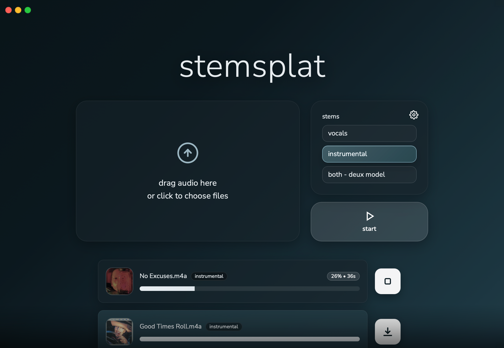

# stemsplat - v0.3.0 release

**MAC ONLY!** This is a free, high quality, no bs stem splitter. No weird numbers to fiddle with and the best quality.

  

## Prerequisites

- Python (I'm using 3.13.5, not sure about other versions)
- APPLE SILICON Mac (M-series)

## Quickstart
1. Download the .zip from the latest release
2. Extract the .zip
3. Open the .app
4. Download the models in the app
5. Done

## Features
- Vocals, instrumental, and deux split modes (quality comparisons on stemsplat.skylarenns.com)
- Batch queue processing
- Mobile/LAN usage for use from other devices
- Export format/folder selection
- No cloud

## Current Models (Thank you Becruily)

**Becruily's Huggingface:**
- Vocals - https://huggingface.co/becruily/mel-band-roformer-vocals/tree/main
- Instrumental - https://huggingface.co/becruily/mel-band-roformer-instrumental/tree/main
- Deux - https://huggingface.co/becruily/mel-band-roformer-deux/tree/main

## v0.4.0 plans
- [ ]  Change port to something that’s not :8000 → 9876
- [ ]  Model Manager: Installed models list (already there), estimated disk usage
- [x]  History (with file size limits, etc.) use to cache outputs, and other stuff. Default user warning to 10GB, able to change this in settings to higher (or lower) amount.
- [x]  EST TIME REMAINING COMPLETE REWORK
- [x]  Model Manager: Installed models list (already there), estimated disk usage
- [ ]  Checksum verification for model downloads
- [ ]  When a lan device tries to process but another device is already processing, say that somewhere
- [ ]  When I right click a song that’s in the queue, have a button say “remove from queue” and a second button that says “change stem” where it brings up the 4 “fast” “quality” “special” “presets” and when hovered over one of those a new list appears to the right with the options in there. Add the same shift+click and cmd/control+click functionality to this right click changer’s options as well.
- [x]  Zip vs separate functionality in settings for multi-stem exports.
- [x]  Add a crap ton of models
- [x]  Add presets
- [ ]  Add “all stems” preset:
Splits vocals
Splits instrumental
Karaoke split on vocal split
6s split on instrumental split (delete the “vocal” stem as it wont have anything)
drum 6s on drum split
- [x]  Crappy tooltips for models
- [ ]  Add user-created presets
- [ ]  UI changes
- [ ]  made the stop button actually work
